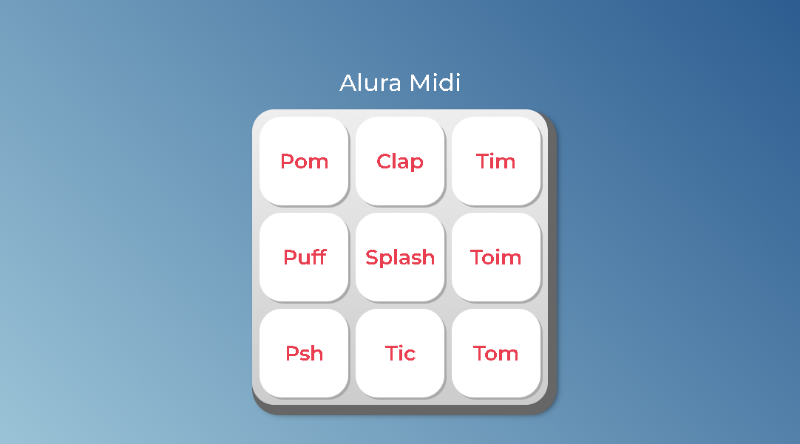

This is a solution to the Interactive page with sounds.

## Table of contents

- [Overview](#overview)
  - The challenge is to build out this interactive rating component and get it looking as close to the design as possible.

- My process: It took me 14 days to build this.
  - Built with: HTML5, CSS3 and JAVASCRIPT.
  - What I learned: I've learned how to manipulate DOM and also I've learned more how to built a responsive page.
  - Continued development: I have to continue practice how to use the responsive page and learn more about js.
  - Useful resources: https://www.w3schools.com/cssref/css3_pr_mediaquery.asp?msclkid=b19e7776c67511ecb597332cb3c06465
- Author: Natali Marinho. 
- Acknowledgments: javascript, css and html.


### The challenge

Users should be able to:

- See hover states for all interactive elements on the page
- Play the sound when clicking at the button

### Screenshot




### Built with

- Semantic HTML5 markup
- CSS custom properties
- Flexbox
- CSS Grid


### What I learned


```js
function tocaSom(seletorAudio) {

   const elemento = document.querySelector(seletorAudio);

   if(elemento && elemento.localName === 'audio'){
            elemento.play();
   } else{
    console.log('Elemento não encontrado ou seletor inválido.');
   }
   
};

const listaDeTeclas = document.querySelectorAll('.tecla');


for(let contador = 0; contador < listaDeTeclas.length; contador++){

    const tecla = listaDeTeclas[contador];
    const instrumento =  tecla.classList[1];
    const idAudio = `#som_${instrumento}`;

    tecla.onclick = function () {
        tocaSom(idAudio);
    };

    tecla.onkeydown = function(evento){
        if(evento.code === 'Enter' || evento.code === 'Space')
        tecla.classList.add("ativa");
    };

    tecla.onkeyup = function(){
        tecla.classList.remove('ativa');
    };

}

```
## Author
- Frontend Mentor - [@natsmarinho](https://www.frontendmentor.io/profile/natsmarinho)
- Twitter - [@natsmarinho](https://www.twitter.com/natsmarinho)
- Instagram - [@natsmarinho](https://www.instagram.com/natsmarinho/)
- Linkedin - [@natsmarinho](https://www.linkedin.com/in/natsmarinho)
